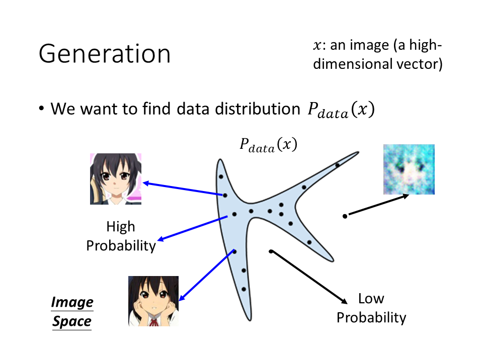

# The Theory behind GAN

本文主要介绍了GAN的基础理论。还对似然函数和KL三度的关系进行了推导。
##  Generation

假设我们今天要生成一张image，这里用x来代表一张image，每一张图片都是高维空间中的一个点，图像大小是64 x 64维的，那么vector的维数就是64 x 64，为了方便演示，下图假设图像是二维空间中的一个点。

对于我们要产生的图像，有一个固定的distribution $P$$data$$(x)$。在整个图像所构成的高维空间中，只有一小部分sample出来的的图像和人脸接近，其他部分都不像人脸。比如我们从下图中<a style="color:blue">蓝色</a>的distribution中进行sample，看起来就很像是人脸（几率是高的），在其他区域就不像人脸（几率是低的）。

那么我们现在的目标就是让机器找到这个distribution。
（但这个distribution长什么样子是不知道的，我们可以收集很多的x得知x可能在某些地方分布比较高。但是把它的式子找出来，我们是不知道怎么做的。）

那么有GAN之前，我们如何做Generate
## Maximum Likelihood Estimation

1. 我们可以从这个distribution中sample图像，但我们并不知道对应的formula长什么样子；
2. 那么我们现在可以找到另外一个distribution $P_G(x,\theta)$,比如其对应参数可以是$\mu,\sum$,来使这个distribution的参数和原来的接近

